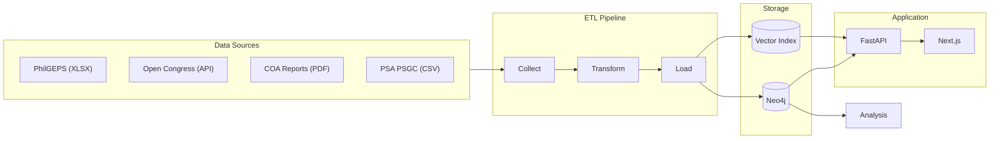

# Paper Trail PH: Follow the paper trail

Philippine Public Accountability Graph. Cross-references four government databases — procurement records, audit reports, legislative data, and geographic codes — to surface relationships that are invisible when the data sits in separate systems.


See [INSIGHTS.md](INSIGHTS.md) for the full analysis and findings.

## What This Does

Philippine government procurement, audit, and election data are published across separate systems that don't talk to each other. A company winning a contract, its owner being related to the mayor, and COA flagging the concentration — these are three separate records in three separate databases. Nobody sees the connection unless they manually cross-reference everything.

This project automates that cross-referencing by:

1. **Collecting** data from PhilGEPS (procurement), Open Congress (legislation), COA (audits), and PSA (geographic codes)
2. **Resolving entities** across datasets (the same company spelled 6 different ways across agencies)
3. **Deriving relationships** that aren't explicit in any single dataset (co-bidding patterns, ownership chains, surname matching)
4. **Loading** everything into a Neo4j graph database
5. **Analyzing** the graph for concentration, collusion, dynasty connections, and procurement red flags
6. **Visualizing** the results in an interactive graph explorer with GraphRAG chat

## Architecture



### Data Pipeline

The pipeline runs in four stages via `scripts/pipeline.py`:

1. **Collect** — pulls raw data from PhilGEPS (Excel downloads), Open Congress (REST API), COA (PDF reports), and PSA (geographic codes). PhilGEPS has no API, so we download and diff weekly Excel datasets.

2. **Transform** — normalizes entity names across agencies (same company spelled 6 different ways), runs Jaro-Winkler fuzzy matching for deduplication (auto-merge at 0.92+, manual review 0.85-0.91), and derives implicit relationships like co-bidding patterns, below-threshold contract clustering, and surname matching between contractor owners and politicians.

3. **Load** — bulk inserts nodes and edges into Neo4j (graph structure) and generates text embeddings into Neo4j's native HNSW vector index (for GraphRAG semantic search).

4. **Analyze** — runs graph queries for concentration metrics (HHI per agency), co-bidding network detection, political dynasty scoring, and 13 automated red flag detectors (contract splitting, bid rigging, phoenix companies, circular subcontracting, etc).

### Stack

- **Graph database:** Neo4j Community Edition
- **Backend:** FastAPI (Python 3.11+), async Neo4j driver
- **Frontend:** Next.js 14, Sigma.js (WebGL graph rendering), Tailwind CSS
- **GraphRAG:** LLM-grounded Q&A over graph context via SSE streaming
- **Analysis:** Python scripts querying Neo4j via Cypher + networkx

## Setup

### Prerequisites

- Docker and Docker Compose
- Python 3.11+
- Node.js 18+

### 1. Start Neo4j

```bash
docker compose up -d
```

Neo4j will be available at `http://localhost:7474` (browser) and `bolt://localhost:7687` (driver).

### 2. Install Dependencies

```bash
# Frontend
npm install

# Backend
python3 -m venv .venv
source .venv/bin/activate
pip3 install -r backend/requirements.txt
```

### 3. Load Graph Data

```bash
cd scripts

# Load the graph from cypher/seed.cypher
python3 pipeline.py bootstrap

# Or run the full pipeline from raw data sources:
# python3 pipeline.py collect --source all --since 2020
# python3 pipeline.py transform --deduplicate --derive-edges
# python3 pipeline.py load --target neo4j
```

### 4. Start the Application

```bash
# Backend (port 8000)
uvicorn backend.main:app --reload --port 8000

# Frontend (port 3000, in a separate terminal)
npm run dev
```

Open `http://localhost:3000` to explore the graph.

## Running Analysis

The analysis scripts query Neo4j directly and produce formatted reports:

```bash
cd scripts

# Run all analyses
python3 pipeline.py analyze

# Run specific module
python3 pipeline.py analyze --module concentration
python3 pipeline.py analyze --module networks
python3 pipeline.py analyze --module dynasties
python3 pipeline.py analyze --module red-flags

# Export as JSON
python3 pipeline.py analyze --json-output > results.json
```

Each module can also run standalone:

```bash
python3 -m analysis.concentration
python3 -m analysis.networks
python3 -m analysis.dynasties
python3 -m analysis.red_flags
```

### Analysis Modules

| Module | What It Detects |
|--------|----------------|
| `concentration` | Agency-level HHI, monopoly suppliers, single-bidder contracts, cross-agency contractor reach |
| `networks` | Co-bidding rings, bid rotation triads, subcontracting loops, shared addresses/officers |
| `dynasties` | Politician-contractor ownership chains, geographic lock-in, dynasty scores, SALN wealth |
| `red-flags` | Contract splitting near RA 9184 thresholds, round amounts, bid rigging indicators, overpricing, unliquidated funds, timeline surges |

### Red Flag Detection API

The backend runs 13 automated red flag detectors against the live graph:

| Endpoint | What It Returns |
|----------|----------------|
| `GET /api/v1/analytics/red-flags` | All detected red flags grouped by entity with risk scoring |
| `GET /api/v1/analytics/network/communities` | Densely connected contractor clusters |
| `GET /api/v1/analytics/subcontract-cycles/{id}` | Circular subcontracting paths for a contractor |
| `GET /api/v1/analytics/campaign-contracts/{id}` | Campaign donation → contract paths for a politician |
| `GET /api/v1/analytics/phoenix-companies` | Companies sharing directors/addresses with blacklisted entities |
| `GET /api/v1/analytics/saln-timeline/{id}` | SALN wealth declarations over time for a politician |

## Pipeline Commands

```bash
cd scripts

python3 pipeline.py collect --source <philgeps|congress|psgc|dynasties|all> [--since 2020]
python3 pipeline.py transform [--deduplicate] [--derive-edges]
python3 pipeline.py load --target <neo4j|vectors|all>
python3 pipeline.py validate [--report]
python3 pipeline.py stats
python3 pipeline.py analyze [--module <name>] [--json-output]
python3 pipeline.py status
python3 pipeline.py bootstrap
```

## Data Sources

All data is public record.

| Source | Access | Notes |
|--------|--------|-------|
| [PhilGEPS](https://open.philgeps.gov.ph) | Manual XLSX download | No API — weekly re-download and diff |
| [Open Congress](https://open-congress-api.bettergov.ph) | REST API | Rate limited, 2 req/sec |
| [COA Reports](https://coa.gov.ph/reports/annual-audit-reports) | PDF download | Unstructured — currently limited to pilot reports |
| [PSA PSGC](https://psa.gov.ph/classification/psgc) | CSV/XLSX download | Municipality codes, province-region mapping |
| [Ateneo Policy Center](https://inclusivedemocracy.ph/data-and-infographics) | Web | Dynasty classification |
| [COMELEC SOCE](https://comelec.gov.ph) | PDF download | Campaign donation filings (Statement of Contributions and Expenses) |
| [GPPB Blacklist](https://www.gppb.gov.ph) | Web | Consolidated blacklisting records |
| [Ombudsman SALN](https://www.ombudsman.gov.ph) | PDF download | Wealth declarations (Statement of Assets, Liabilities and Net Worth) |

## Project Structure

```
paper-trail-ph/
├── backend/                 # FastAPI application
│   ├── routers/            # API endpoints (graph, analytics, chat)
│   ├── services/           # Neo4j queries, GraphRAG, LLM
│   └── models/             # Pydantic models
├── src/                     # Next.js frontend
│   ├── app/                # Pages and layout
│   ├── components/         # Graph canvas, chat, analytics
│   ├── lib/                # API client, constants
│   └── types/              # TypeScript types
├── scripts/                 # Data pipeline
│   ├── collectors/         # Data source collectors
│   ├── transformers/       # Entity resolution, relationship derivation
│   ├── loaders/            # Neo4j and vector index loaders
│   ├── quality/            # Validation and statistics
│   ├── analysis/           # Graph analysis modules
│   └── pipeline.py         # CLI entrypoint
├── cypher/                  # Neo4j schema and data
│   ├── schema.cypher       # Constraints and indexes
│   └── seed.cypher         # Initial graph data
├── INSIGHTS.md              # Full analysis findings with methodology
└── docker-compose.yml       # Neo4j container
```

## Environment Variables

Copy `.env.example` to `.env` and configure:

```bash
NEO4J_URI=bolt://localhost:7687
NEO4J_USER=neo4j
NEO4J_PASSWORD=password

# Optional — for GraphRAG chat
OPENAI_API_KEY=sk-...
ANTHROPIC_API_KEY=sk-ant-...
```

## Disclaimer

Red flags identified by this analysis are statistical patterns derived from publicly available government records. They are not accusations of wrongdoing. All data comes from government-published sources.
